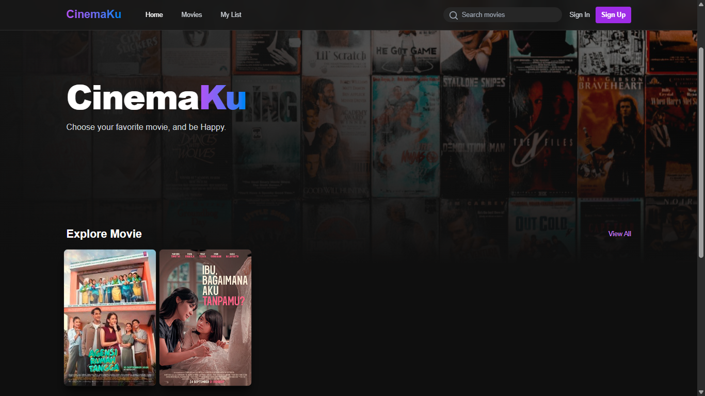
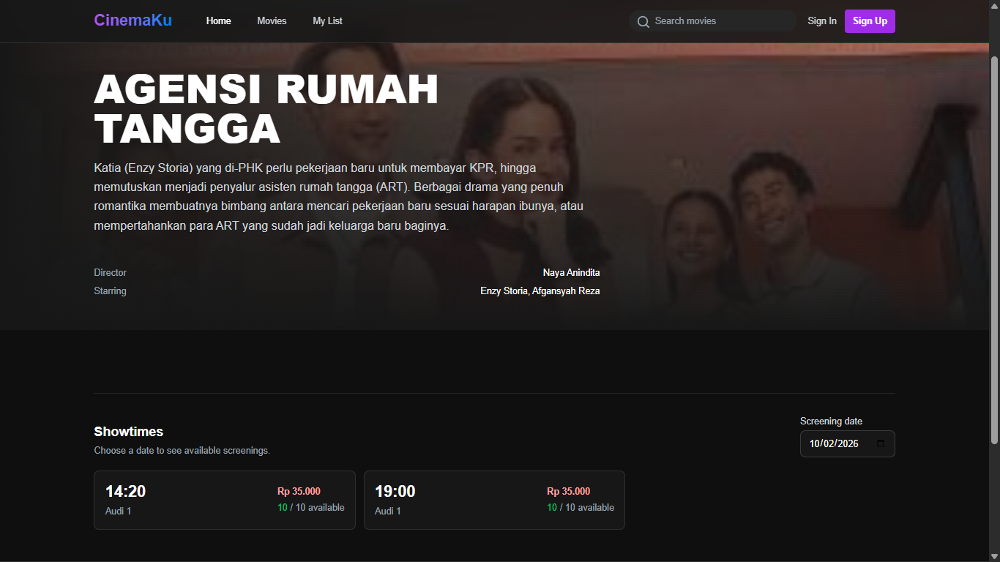
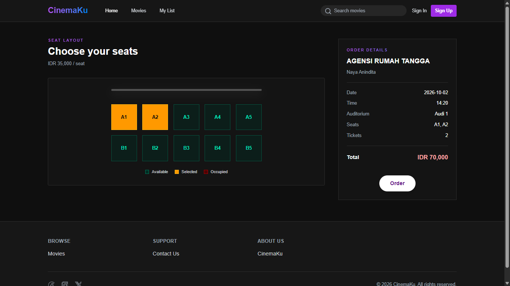
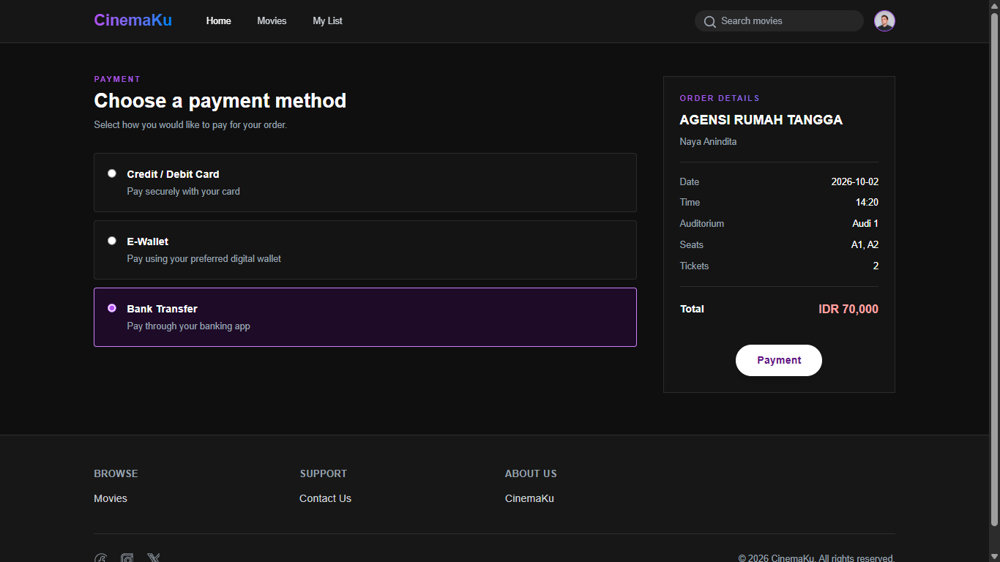
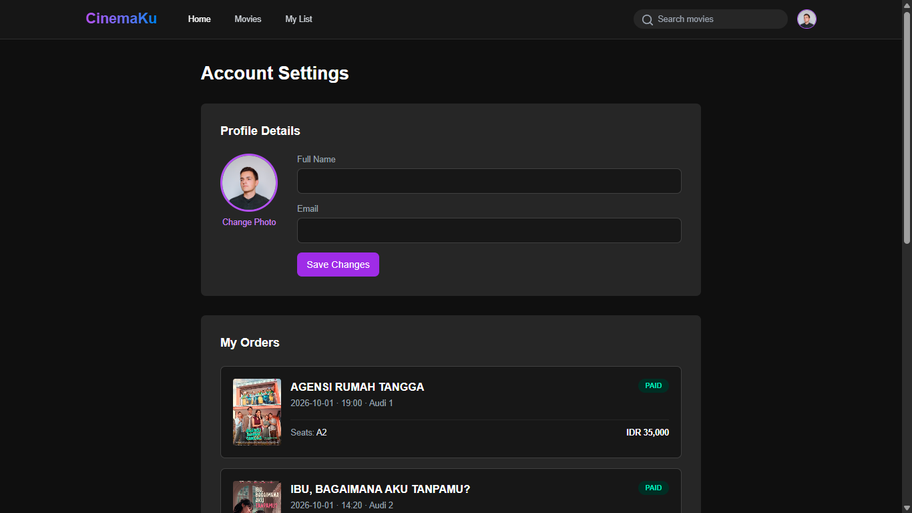
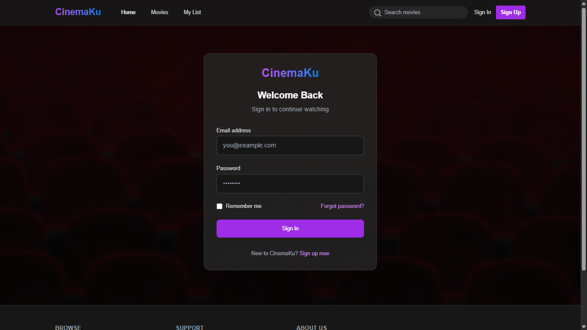

# CinemaKu

 |  |  |
|------------------------------------------|------------------------------------------|------------------------------------------|
|  |  |  |

"CinemaKu" is a website inspired by the CGV website, which is used to order movie tickets. This website is designed using `SQL` database, with `Nest.js` backend, and `Vue.js` frontend.

## Run Locally

Clone the project

```bash
  git clone https://github.com/septyanagstn/mini-bioskop.git
```

Go to the project directory

```bash
  cd mini-bioskop
```

### Database

Go to the db project directory, download `.sql` file and import to your database.

### Backend

Go to the backend project directory

```bash
  cd backend-bioskop
```

Install dependencies

```bash
  npm install
```

Generate Prisma schema

```bash
  npx prisma generate
```

Start the server

```bash
  npm run start
```

### Frontend

Go to the project directory

```bash
  cd frontend-bioskop
```

Install dependencies

```bash
  npm install
```

Start the server

```bash
  npm run dev
```


## 🔗 Links
[](https://septyanagstn.github.io/portofolio/)
[](https://www.linkedin.com/in/septyana-agustina)
[](https://instagram.com/septyanagstn/)

